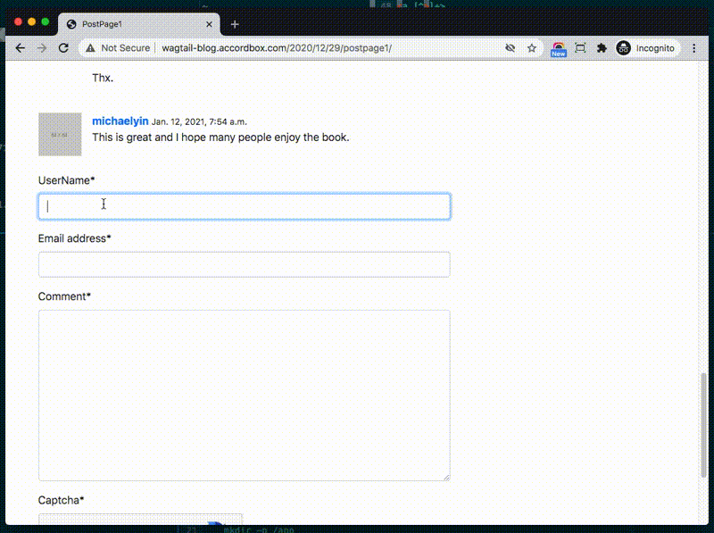

## Introduction

This project is from my book [Build Blog With Wagtail CMS](https://leanpub.com/buildblogwithwagtailcms/)

Other Wagtail Books Writeen by me

* [The Definitive Guide to Next.js and Wagtail](https://leanpub.com/the-definitive-guide-to-nextjs-and-wagtail/)
* [Build SPA with React and Wagtail](https://leanpub.com/react-wagtail)
* [Build Blog with React (SSR) and Wagtail](https://leanpub.com/react-wagtail-ssr)

## Objective

This book will teach you how to build a modern blog with `Wagtail CMS`

By the end of this course, you will be able to:

1. Understand `Docker` and use `Docker Compose` to do development
1. Create blog models to work with Wagtail.
1. Import `Bootstrap` themes to the blog.
1. Use `PDB` and `Django shell` to debug, test code and check data in terminal.
1. Learn to use `RoutablePage` and add `Date` to the post url.
1. Build `Pagination` component and correctly handle querystring.
1. Make the blog supports writing in `Markdown` and `Latex`.
1. Create contact page using Wagtail `FormBuilder`
1. Build menu, meta tags, sitemap, robots.txt for better SEO.
1. Build comment system based on `django-contrib-comments` which support `Generic Relations`
1. Create Frontend project from `python-webpack-boilerplate` and load compiled CSS and JS in Django template.
1. Learn SCSS and use it to customize style in quick way.
1. Use `Tribute.js`, `Axios` to add `Mention` and `Emoji` support to the comment form.
1. Learn `Async/Await`, `Promise` and the benefits.
1. Deploy the production app to DigitalOcean

## Tech

* Python 3.8
* Django 3.2
* Wagtail 2.14
* Node.js 12
* Webpack 5
* Bootstrap 5.1
* Tribute.js
* Axios

## How to run on local

You need Docker and Docker Compose and you can install it here [Get Docker](https://docs.docker.com/get-docker/)

```bash
$ git clone https://github.com/AccordBox/wagtail-bootstrap-blog
$ cd wagtail-bootstrap-blog
# build and lanch app
$ docker-compose up --build
```

Now open a new terminal to import data and change password.

```bash
$ docker-compose exec web python manage.py load_initial_data
$ docker-compose exec web python manage.py changepassword admin
```

Now you can check on

* [http://127.0.0.1:8000](http://127.0.0.1:8000)

## Demo

The demo is also online if you want to check.

* [Wagtail Blog Demo](http://wagtail-blog.accordbox.com)

## ScreenShot


